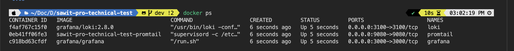
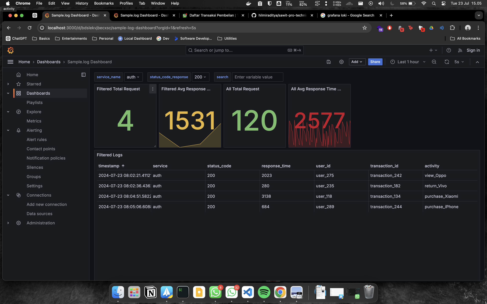
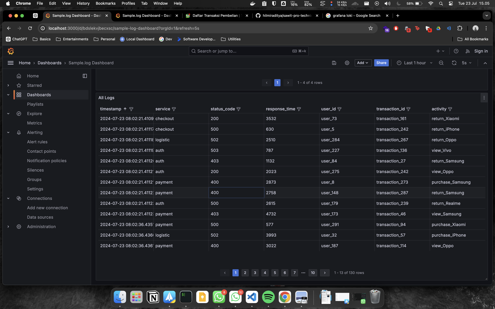

<br />
<div align="center">
  <a href="https://github.com/othneildrew/Best-README-Template">
    
  </a>

  <h3 align="center">Sawit Pro Technical Test</h3>

  <p align="center">
    Site Reliability Engineer
    <br />
    <a href="#"><strong>Hilmi Raditya Prakoso</strong></a>
    <br />
    <br />
    <a href="https://www.linkedin.com/in/hilmiraditya/">LinkedIn</a>
    ·
    <a href="https://www.instagram.com/hilmiraditya/">Instagram</a>
  </p>
</div>


## Log Parsing and Transformation:

Since i've been making Makefile. so let me show you how to run all of these

### Script for generate.log

Actually, I'm using python3 to generate log based on the format : 
  ```sh
  [timestamp] [service_name] [status_code] [response_time_ms] [user_id] [transaction_id] [additional_info]
  ```
Simply just run : 

  ```sh
  make generate-log
  ```
It will generate sample.log on these repository, if you want to run, don't worry sample.log already store in .gitgnore


### Extract relevant metrics & convert it to JSON

Simply just run : 

  ```sh
  make categorized-log
  make json-convert-log
  ```
it will be show total of every status code response, total of transaction activity, also average response time and total requests. 

and this python make a split by status code log and transaction actitivy (purchase, return and view)


example of 200.log

example of transaction activity purchase.log

the json file also was converted from sample.log file


## Monitoring & Logging:

I used Grafana, Loki & Promtail that running using docker-compose. Why I used all of these ? 

Grafana + Loki + Promtail offering an efficient and cost-effective logging solution with seamless integration. Also It's free and I already used these tools before. 

There will be 3 containers : 
1. Grafana : for visualize the loggging
2. Loki : for log aggregation system
3. Promtail : for grep the log based on directory. And on these container there will be a python file which generated log every interval s and how many lines will be generated that declared on supervisord.conf (we assume that promtail containers is like a virtual machine, there are some agent run and stored on /var/log*.log)

Simply just run : 

  ```sh
  make compose-up
  ```

it will be pulling image for grafana, loki and also build the image for promtail based on Dockerfile on ./promtail directotry





After the compose up, you can access the dashboard can be here : http://localhost:3000/d/bdslekvjbecxsc/sample-log-dashboard?orgId=1&refresh=5s

there are some feature on monitoring : 
1. show all logs (without filter )
2. show all logs 
3. count all total request (without filter)
4. count all total request
5. get all average response time on ms (without filter)
6. get all average response time on ms

