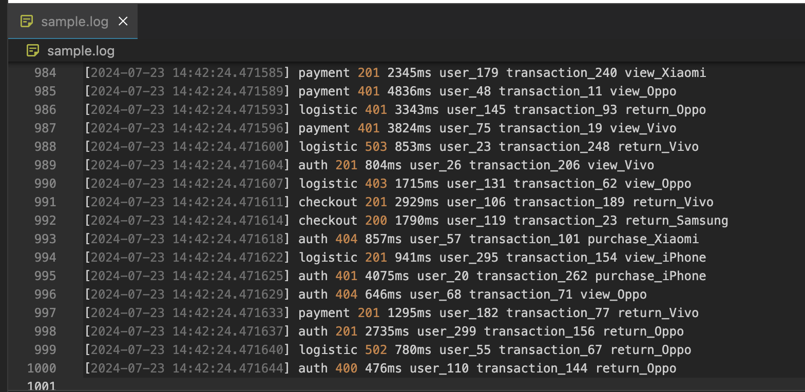

<br />
<div align="center">
  <a href="https://github.com/othneildrew/Best-README-Template">
    
  </a>

  <h3 align="center">Sawit Pro Technical Test</h3>

  <p align="center">
    Site Reliability Engineer
    <br />
    <a href="#"><strong>Hilmi Raditya Prakoso</strong></a>
    <br />
    <br />
    <a href="https://www.linkedin.com/in/hilmiraditya/">LinkedIn</a>
    ·
    <a href="https://www.instagram.com/hilmiraditya/">Instagram</a>
  </p>
</div>


## Log Parsing and Transformation:

Since i've been making Makefile. so let me show you how to run all of these

### Script for generate.log

Actually, I'm using python3 to generate log based on the format : 
  ```sh
  [timestamp] [service_name] [status_code] [response_time_ms] [user_id] [transaction_id] [additional_info]
  ```
Simply just run : 

  ```sh
  make generate-log
  ```
It will generate sample.log on these repository, if you want to run, don't worry sample.log already store in .gitgnore




### Extract relevant metrics & convert it to JSON

Simply just run : 

  ```sh
  make categorized-log
  make json-convert-log
  ```
it will be show total of every status code response, total of transaction activity, also average response time and total requests. 

and this python make a split by status code log and transaction actitivy (purchase, return and view)


example of 200.log

example of transaction activity purchase.log

the json file also was converted from sample.log file

